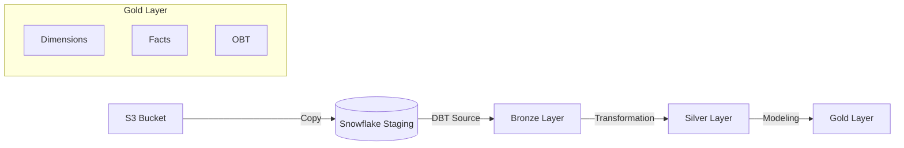

# Airbnb End-To-End Data Engineering Project

## 🚀 Project Overview
This project implements a robust end-to-end data pipeline using **DBT (Data Build Tool)** and **Snowflake**. It creates a modern data warehouse structure (Bronze, Silver, Gold layers) to process Airbnb data, starting from raw staging in Snowflake (sourced from S3) to final analytical models (Facts, Dimensions, and One Big Table).

---

## 🏗️ Architecture & Data Flow

The pipeline follows the Medallion Architecture:



### 1. Staging (Source)
- **Source:** Raw CSV data loaded into Snowflake `AIRBNB.STAGING` schema from S3.
- **Tables:** `listings`, `hosts`, `bookings`
- **Configuration:** Defined in `models/sources/sources.yml`

### 2. Bronze Layer (Raw Ingestion)
- **Schema:** `bronze`
- **Objective:** Ingest raw data from staging with minimal transformation.
- **Strategy:** Incremental loading to handle new records efficiently.
- **Models:**
  - `bronze_listings.sql`
  - `bronze_hosts.sql`
  - `bronze_bookings.sql`

### 3. Silver Layer (Cleaned & Transformed)
- **Schema:** `silver`
- **Objective:** Cleanse data, standardize formats, and add business logic.
- **Key Features:**
  - **Tagging:** Uses custom macros (e.g., `tag('PRICE_PER_NIGHT')`) to categorize data.
  - **Incremental Logic:** Optimizes performance by processing only new/changed data.
- **Models:**
  - `silver_listings.sql`
  - `silver_hosts.sql`
  - `silver_bookings.sql`

### 4. Gold Layer (Business Intelligence)
- **Schema:** `gold`
- **Objective:** Production-ready data for reporting and analytics.
- **Components:**
  - **OBT (One Big Table):** `obt.sql` uses Jinja templating to dynamically join silver tables into a wide, de-normalized table for easy analysis.
  - **Facts & Dimensions:**
    - `facts.sql`: Derives metrics connecting dimensions.
    - `ephemeral/` models: Intermediate calculations for dimensionality.
  - **Snapshots:** SCD Type 2 tracking for dimensions (e.g., `dim_listings`) configured in the `snapshots/` directory.

---

## ⚙️ Project Setup

### 1. Configuration (`dbt_project.yml`)
The project is configured to map models to specific schemas:
- `bronze` -> `+materialized: table`
- `silver` -> `+materialized: table`
- `gold` -> `+materialized: table`

### 2. Profile Setup
**Do not** commit your actual credentials. Use the provided template to create your local `profiles.yml`.

**Template:** `profiles example.yml`
```yaml
aws_dbt_snowflake_project:
  target: dev
  outputs:
    dev:
      type: snowflake
      account: <YOUR_ACCOUNT>
      user: <YOUR_USER>
      password: <YOUR_PASSWORD>
      role: ACCOUNTADMIN
      database: AIRBNB
      warehouse: COMPUTE_WH
      schema: dbt_schema
      threads: 1
```

---

## 🛠️ Advanced DBT Features

### Macros
Reusable SQL snippets to keep code DRY (Don't Repeat Yourself):
- `tag.sql`: Generates tags based on column values.
- `trimmer.sql`: Utility for string cleaning.
- `generate_schema_name.sql`: Custom schema naming logic.

### Snapshots
Implements **Slowly Changing Dimensions (SCD Type 2)** to track historical changes in data (e.g., price changes, host status updates).
- Configured in `snapshots/*.yml` files.
- Tracks `updated_at` timestamps to manage validity windows (`dbt_valid_from`, `dbt_valid_to`).

### Analyses
Ad-hoc analytical queries located in the `analyses/` folder (e.g., `explore.sql`) for exploring data without creating permanent models.

---

## 🧪 Testing & Quality Assurance

### Source Testing & Alerts
Robust testing ensures data quality before processing.
- **Sources Test:** `tests/sources_test.sql` checks for anomalies, such as `booking_amount < 2000`.
- **Alerting:** Configured with `severity = 'warn'`, meaning looking for these conditions will trigger warnings in the DBT run logs but not stop the pipeline, allowing for proactive monitoring.

```sql
{{ config(severity = 'warn') }}
SELECT 1 FROM {{ source('staging', 'bookings') }} WHERE booking_amount < 2000
```

---

## 🏃‍♂️ How to Run

1. **Install Dependencies:**
   ```bash
   dbt deps
   ```

2. **Debug Connection:**
   ```bash
   dbt debug
   ```

3. **Run the Pipeline:**
   ```bash
   dbt run
   ```
   *Runs all models: Bronze -> Silver -> Gold.*

4. **Run Tests:**
   ```bash
   dbt test
   ```
   *Executes schema tests and custom tests (including warnings).*

5. **Generate Documentation:**
   ```bash
   dbt docs generate
   dbt docs serve
   ```
