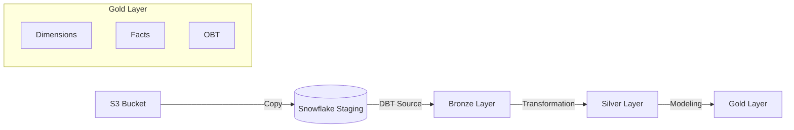

# Airbnb End-To-End Data Engineering Project

## 🚀 Project Overview
This project implements a robust end-to-end data pipeline using **DBT (Data Build Tool)** and **Snowflake**. It creates a modern data warehouse structure (Bronze, Silver, Gold layers) to process Airbnb data, starting from raw staging in Snowflake (sourced from S3) to final analytical models (Facts, Dimensions, and One Big Table).

---

## 🏗️ Architecture & Data Flow

The pipeline follows the Medallion Architecture:



### 1. Staging (Source)
- **Source:** Raw CSV data loaded into Snowflake `AIRBNB.STAGING` schema from S3.
- **Tables:** `listings`, `hosts`, `bookings`
- **Configuration:** Defined in `models/sources/sources.yml`

---

## 🧠 Key DBT Concepts & Implementation Details

This project leverages advanced DBT features to ensure scalability, maintainability, and clean code. Below is a deep dive into the specific concepts used:

### 1. Materialization Strategies
We use different materialization strategies per layer to balance performance and storage.

- **Incremental Models (Bronze & Silver):**
  - **Concept:** Instead of rebuilding the entire table every run, we only process *new* or *changed* records.
  - **Implementation:** In `bronze_listings.sql`, we use the `is_incremental()` macro.
    ```sql
    
      WHERE CREATED_AT > (SELECT MAX(CREATED_AT) FROM {{ this }})
    
    ```
  - **Benefit:** Drastically reduces warehouse compute costs and runtime for large datasets.

- **Ephemeral Models (Gold Helper Models):**
  - **Concept:** These are virtually defined models that are not materialized as physical tables/views in the database. Instead, their code is interpolated into downstream models (like a CTE).
  - **Usage:** Located in `models/gold/ephemeral`. Used for intermediate calculations that don't need to be queried directly.

- **Table Materialization:**
  - Used for final Gold layer models to ensure fast query performance for BI tools.

### 2. Jinja Templating & Dynamic SQL
We use Jinja extensively to write "DRY" (Don't Repeat Yourself) SQL.

- **Dynamic OBT Generation:**
  - In `models/gold/obt.sql`, typically one would write a massive `SELECT ... LEFT JOIN ... LEFT JOIN ...` query.
  - **Our Approach:** We define the structure in a dictionary (`configs`) at the top of the file and iterate over it.
    ```jinja2
    
    -- Loop to generate SELECT columns
     ... 
    -- Loop to generate JOINS
     ... 
    ```
  - **Benefit:** Adding a new table to the OBT is as simple as adding an entry to the `configs` list, rather than rewriting complex SQL joins.

### 3. Custom Macros
Macros are reusable functions written in Jinja/SQL throughout the project.

- **`tag.sql`:**
  - **Purpose:** Encapsulates business logic for categorizing data (e.g., tagging listings as 'Luxury', 'Economy' based on price).
  - **Usage:** `{{ tag('PRICE_PER_NIGHT') }}` inside select statements.
  - **Benefit:** If the business definition of "Luxury" changes, we update it in *one place* (the macro), and all models reflect the change.

- **`trimmer.sql`:**
  - **Purpose:** A utility macro to automatically trim whitespace from string columns.

### 4. Snapshots (SCD Type 2)
We implement **Slowly Changing Dimensions (SCD Type 2)** to track historical data changes.

- **File:** `snapshots/dim_listings.yml`
- **Configuration:**
  - `strategy: timestamp`: Uses a column (e.g., `updated_at`) to detect changes.
  - `dbt_valid_from` / `dbt_valid_to`: DBT automatically manages these columns.
- **Outcome:** If a host changes their listing price, we keep the *old* price record (with an expiry date) and insert a *new* record. This allows for accurate historical reporting ("What was the price *last month*?").

### 5. Specialized Testing & Alerts
We go beyond standard schema tests (unique, not null) to implement business rule validation.

- **Source Freshness & Integrity:**
  - We test raw data in `tests/sources_test.sql`.
- **Severity Configuration:**
  - We use `config(severity = 'warn')` for non-critical anomalies.
  - **Example:** `SELECT 1 FROM ... WHERE booking_amount < 2000`
  - This warns us if booking values look suspicious but allows the pipeline to complete, preventing pipeline blockage for minor data quality warnings.

---

## ⚙️ Project Setup

### 1. Configuration (`dbt_project.yml`)
The project is configured to map models to specific schemas:
- `bronze` -> `+materialized: table`
- `silver` -> `+materialized: table`
- `gold` -> `+materialized: table`

### 2. Profile Setup
**Do not** commit your actual credentials. Use the provided template to create your local `profiles.yml`.

**Template:** `profiles example.yml`
```yaml
aws_dbt_snowflake_project:
  target: dev
  outputs:
    dev:
      type: snowflake
      account: <YOUR_ACCOUNT>
      user: <YOUR_USER>
      password: <YOUR_PASSWORD>
      role: ACCOUNTADMIN
      database: AIRBNB
      warehouse: COMPUTE_WH
      schema: dbt_schema
      threads: 1
```

---

## 🏃‍♂️ How to Run

1. **Install Dependencies:**
   ```bash
   dbt deps
   ```

2. **Debug Connection:**
   ```bash
   dbt debug
   ```

3. **Run the Pipeline:**
   ```bash
   dbt run
   ```
   *Runs all models: Bronze -> Silver -> Gold.*

4. **Run Tests:**
   ```bash
   dbt test
   ```
   *Executes schema tests and custom tests (including warnings).*

5. **Generate Documentation:**
   ```bash
   dbt docs generate
   dbt docs serve
   ```
